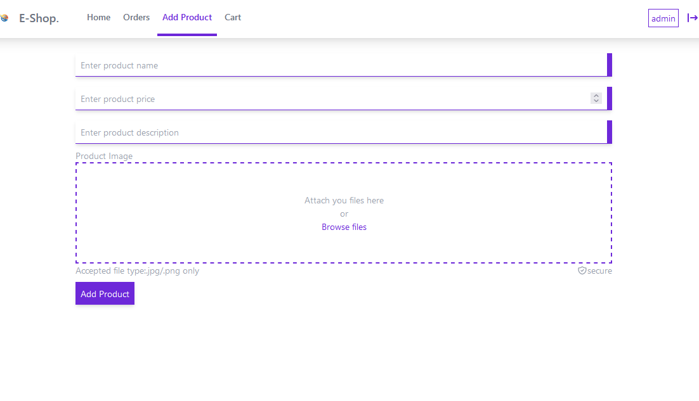
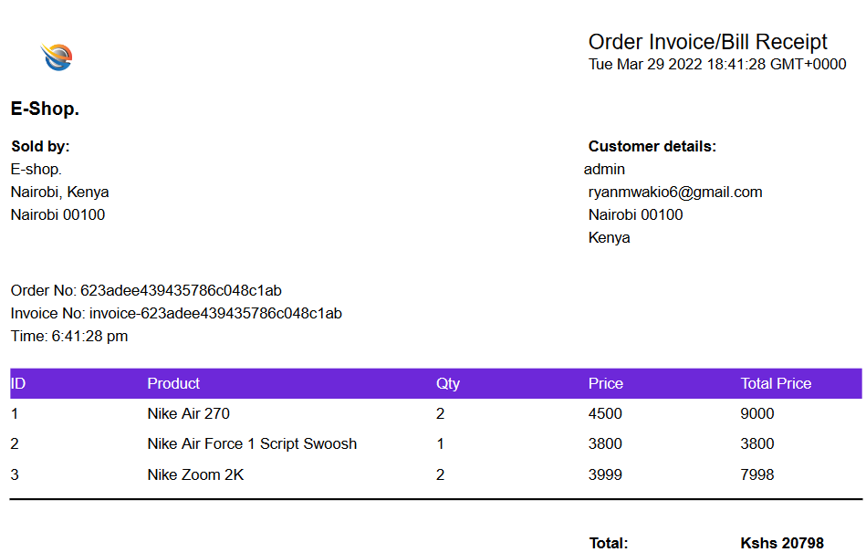

# eshop



eshop, an eccomerce platform for selling and buying goods ready with m-pesa intergration and invoice generation.

##### sample invoice


[pdf invoice](./for_docs/invoice-623adee439435786c048c1ab.pdf)

### features include:

- email sending on authentication processes and once order is sent.
  - signup
  - forgot password
  - signin
- payment integration

### architecture

we are using the (MVC) paradigm for developing this software. This facilitates separation of concerns and decouples the software for ease in debugging and for collaboration.

model - database layer<br>
view - the client side of the app<br>
controller - all the business logic (the middleman)<br>

\*for the views we are using ejs<br> \* for database we are using mongodb

---

Folder structure:

```
eshop
│   README.md
│   app.js (the entry point)
│   package.json
│   Procfile
│   tailwind.config.js
│
+───models (all models)
│   │   Order.js
│   │   Product.js
│   │   ...
│
│
+───views (all client side views)
|   shop.ejs
|   cart.ejs
|   orders.ejs
|   ...
|   +   auth
|   │   login.ejs
|   │   register.ejs
|   │   reset.ejs
|   │   ...
|   +   include (all the view partials that are reusable)
|   |   navbar.ejs
|
+   public (folder exposed to public)
|   +   css
|   +   images
|   +   js (client side js)
|
+   routes (all routes and http verbs)
|
|
+   util (utility functions that can be reused)
```

---

### Run the app

Clone the project<br>
Install all dependencies

```
npm install
```

Generate a .env file at the root

```
#express config
HOST="your host"
HOST_URL="your url"

#database variables
MONGO_USER="mongodb username"
MONGO_PASSWORD="your password"
MONGO_DATABASE="database name"

#firebase config
CLOUDINARY_NAME="cloudinary name"
CLOUDINARY_API_KEY="cloudinary key"
CLOUDINARY_API_SECRET="cloudinary secret"


```

```bash
npm run server
```

---


